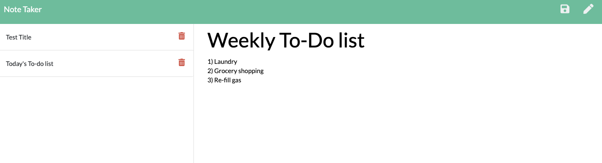

# Note Taker

### Description
Use Note Taker to quickly create notes and save them for easy access. Once you're done with a note, you can as quickly delete the note to clear it from your saved notes list. 

### Deployed Application
Create your first note with the note taker application now! Link to app: https://afternoon-taiga-69723.herokuapp.com/

## Note Taker Homepage

## Note Taker Note Creation

Easily create a new note and save it. All new notes appear on the left of the page sorted by oldest to newest. To delete a note once you're complete, hit the trash icon. 

### User Story
AS A user, I want to be able to write and save notes
I WANT to be able to delete notes I've written before
SO THAT I can organize my thoughts and keep track of tasks I need to complete

### Acceptance Criteria
Application should allow users to create and save notes.
Application should allow users to view previously saved notes.
Application should allow users to delete previously saved notes.

### Dependencies
UUID - https://www.npmjs.com/package/uuid
Express - https://www.npmjs.com/package/express

### Contact
Melanie DeBarros

